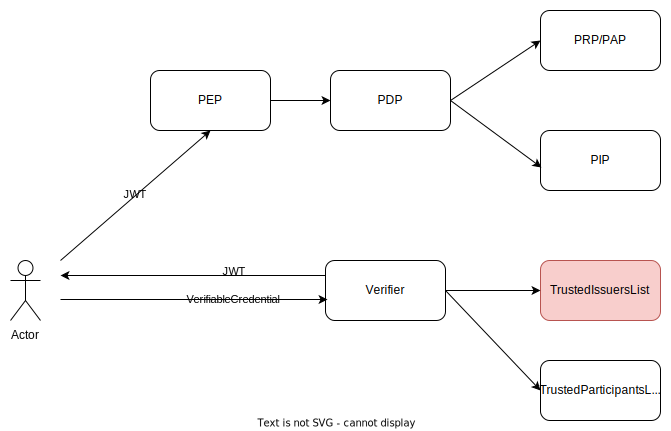

# Trusted Issuers List

The Trusted-Issuers-List Service provides an 
[EBSI Trusted Issuers Registry](https://api-pilot.ebsi.eu/docs/apis/trusted-issuers-registry/v4#/) implementation to act
as the Trusted-List-Service in the DSBA Trust and IAM Framework. 
In addition, a [Trusted Issuers List API](./api/trusted-issuers-list.yaml) to manage the issuers is provided.

[](https://www.fiware.org/developers/catalogue/)
[](https://opensource.org/licenses/Apache-2.0)
[](https://quay.io/repository/fiware/trusted-issuers-list)
[](https://coveralls.io/github/FIWARE/trusted-issuers-list?branch=main)
[](https://github.com/FIWARE/trusted-issuers-list/actions/workflows/test.yml)
[](https://github.com/FIWARE/trusted-issuers-list/actions/workflows/release.yml)

## Background

In an DSBA-compliant framework, the [Verifier](https://github.com/FIWARE/VCVerifier) has to check for incoming
[VerifiableCredentials](https://www.w3.org/TR/vc-data-model/) that the corresponding issuer is allowed to issue:
- the given type of credential
- with the given claims
- and at the current time

To do so, it requires a service that provides such information, e.g. the Trusted Issuers List. See the following diagram 
on how the Trusted Issuers List integrates into the framework.



## Installation

### Container

The Trusted-Issuers-List Service is provided as a container at [quay.io](https://quay.io/repository/fiware/trusted-issuers-list).
To store information about the issuers, a database has to be provided. In a local setup, you can for example use:
```shell
docker run --name mysql -p 3306:3306 -e MYSQL_ROOT_PASSWORD=root -e MYSQL_USER=user -e MYSQL_PASSWORD=password -e MYSQL_DATABASE=db mysql
```
and the start the service:
```shell
docker run --network host quay.io/fiware/trusted-issuers-list:0.0.1
```
After that, its accessible at ```localhost:8080```.

### Configuration

Configurations can be provided with the standard mechanisms of the [Micronaut-Framework](https://micronaut.io/), e.g. [environment variables or appliction.yaml file](https://docs.micronaut.io/3.1.3/guide/index.html#configurationProperties).
The following table concentrates on the most important configuration parameters:

| Property                              | Env-Var                                 | Description                                                                     | Default                              |
|---------------------------------------|-----------------------------------------|---------------------------------------------------------------------------------|--------------------------------------|
| `micronaut.server.port`               | `MICRONAUT_SERVER_PORT`                 | Server port to be used for the notification proxy.                              | 8080                                 |
| `micronaut.metrics.enabled`           | `MICRONAUT_METRICS_ENABLED`             | Enable the metrics gathering                                                    | true                                 |
| `datasources.default.url`             | `DATASOURCES_DEFAULT_URL`               | JDBC connection string to the database.                                         | ```jdbc:mysql://localhost:3306/db``` |
| `datasources.default.driverClassName` | `DATASOURCES_DEFAULT_DRIVER_CLASS_NAME` | Driver to be used for the database connection.                                  | ```com.mysql.cj.jdbc.Driver```       |
| `datasources.default.username`        | `DATASOURCES_DEFAULT_USERNAME`          | Username to authenticate at the database.                                       | ```user```                           |
| `datasources.default.password`        | `DATASOURCES_DEFAULT_PASSWORD`          | Password to authenticate at the database.                                       | ```password```                       |
| `datasources.default.dialect`         | `DATASOURCES_DEFAULT_DIALECT`           | Dialect to be used with the DB. Currently MYSQL, H2 and POSTGRES are supported. | ```MYSQL```                          |

### Database

Trusted-Issuers-List requires an SQL database. It currently supports MySql-compatible DBs and H2 (as an In-Memory DB for dev/test purposes) and PostgreSQL.
Migrations are applied via [flyway](https://flywaydb.org/), see the [migration-scripts](./src/main/resources/db/migration) for the schema.


By default, the system is configured to use MySQL. To run it with PostgreSQL, you should update the following configuration:

```yaml
# Update default datasource dialect and driver
datasources:
  default:
    url: jdbc:postgresql://localhost:5432/db
    driverClassName: org.postgresql.Driver
    username: superuser
    password: superpassword
    dialect: POSTGRES
# Update migration scripts location
flyway:
  datasources:
    default:
      locations: classpath:db/migration/postgresql
```
## Usage

2 APIs are provided by the service:
- [Trusted-Issuers-List API](./api/trusted-issuers-list.yaml) for managing the issuers and there credential-configurations
- [Trusted-Issuers-Registry API](./api/trusted-issuers-registry.yaml) to provide the information in an [EBSI compatible](https://api-pilot.ebsi.eu/docs/apis/trusted-issuers-registry/latest#/) format.

To have information about an issuer available at the [Trusted-Issuers-Registry API](./api/trusted-issuers-registry.yaml), it first needs to be created.
An example request would look like:
```shell
curl --location 'localhost:8080/issuer' \
--header 'Content-Type: application/json' \
--data '{
  "did": "did:web:happypets.org",
  "credentials": [
    {
      "validFor": {
        "from": "2017-07-21T17:32:28Z",
        "to": "2023-07-21T17:32:28Z"
      },
      "credentialsType": "CustomerCredential",
      "claims": [
        {
          "name": "roles",
          "allowedValues": [
            "GOLD_CUSTOMER",
            "STANDARD_CUSTOMER"
          ]
        }
      ]
    }
  ]
}'
```
Such configuration should allow the issuer ```did:web:happypets.org``` to issue credentials of type ```CustomerCredential```
with the claim ```roles``` having the values ```GOLD_CUSTOMER``` or ```STANDARD_CUSTOMER```.

The issuer can then be accessed through the [Trusted-Issuers-Registry API](./api/trusted-issuers-registry.yaml) via:

```shell
curl --location 'localhost:8080/v4/issuers/did:web:happypets.org'
```

and receive:
```shell
{
    "did": "did:web:happypets.org",
    "attributes": [
        {
            "hash": "7wuJF3v4COk0jdDwAYKq7Gsl6z6c1NxZ6O/ONplfD5k=",
            "body": "eyJjcmVkZW50aWFsc1R5cGUiOiJDdXN0b21lckNyZWRlbnRpYWwiLCJjbGFpbXMiOlt7Im5hbWUiOiJyb2xlcyIsImFsbG93ZWRWYWx1ZXMiOlsiU1RBTkRBUkRfQ1VTVE9NRVIiLCJHT0xEX0NVU1RPTUVSIl19XX0=",
            "issuerType": "Undefined"
        }
    ]
}
```

In order to make sense of the registry response, a data-format for the attributes is defined. The body of an attribute conforms 
to a "Credential" as defined in in the [Trusted-Issuers-List API](./api/trusted-issuers-list.yaml), e.g.:
```yaml
components:
  schemas:
    TimeRange:
      type: object
      properties:
        from:
          type: string
          format: date-time
          example: '2017-07-21T17:32:28Z'
        to:
          type: string
          format: date-time
          example: '2023-07-21T17:32:28Z'
    Claim:
      description: "Claim specific configuration of a credential"
      type: object
      properties:
        name:
          description: "Name of the claim to be configured"
          type: string
          example: roles
        allowedValues:
          description: "A list of values allowed for the claim"
          type: array
          items:
            type: object
          example:
            - true
            - 12
            - "GOLD_CUSTOMER"
            - "STANDARD_CUSTOMER"
    Credentials:
      description: "Configuration of the capabilites that the issuer has for the credential"
      type: object
      properties:
        validFor:
          $ref: '#/components/schemas/TimeRange'
        credentialsType:
          description: "Type of the credential"
          type: string
          example: "CustomerCredential"
        claims:
          description: "A list of claim specific configurations. Claims that are not listed do not have any restriction, claims listed, but with empty allowed values are forbidden."
          type: array
          items:
            $ref: '#/components/schemas/Claim'
```

## License

Trusted-Issuers-List is licensed under the Apache License, Version 2.0. See LICENSE for the full license text.

© 2023 FIWARE Foundation e.V.
